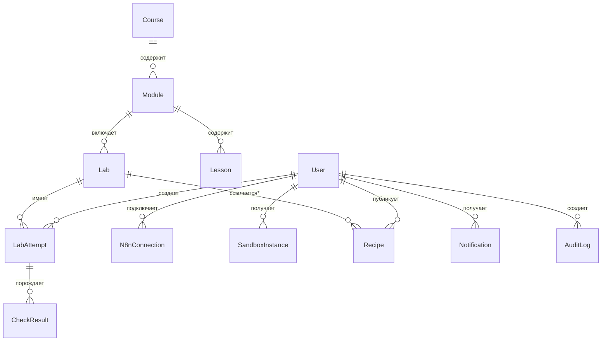
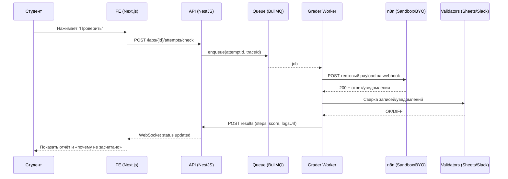
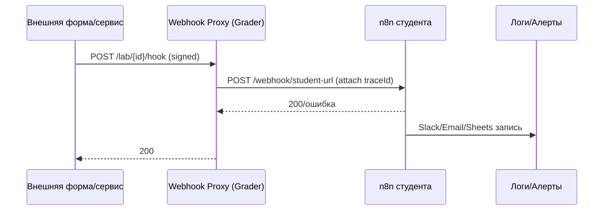

## 1) Краткое резюме проекта

**Назначение продукта.** Веб‑программа (LMS + практикум) для обучения с нуля автоматизации бизнес‑процессов на n8n: теория, пошаговые туториалы, лабораторные с автопроверкой, песочницы n8n.

**Целевая аудитория.** Новички: предприниматели, операционные менеджеры, маркетологи без опыта интеграций/кодинга.

**Ключевая ценность.** Быстрый выход на первую рабочую автоматизацию (≤ 2 часа от регистрации), системное освоение n8n до уровня самостоятельного внедрения интеграций в бизнесе.

**KPI/метрики успеха.**

* Завершение курса v1.0: ≥ 45% пользователей, начавших модуль 1.
* Доля успешно выполненных лабораторных (первой попыткой): ≥ 60% (P50), ≥ 80% (до 3‑й попытки).
* NPS выпускников: ≥ +45.
* Время до первой автоматизации (срабатанный прод‑вебхук/расписание): медиана ≤ 2 ч, P90 ≤ 24 ч.
* Время автопроверки лабораторной: медиана ≤ 15 с, P95 ≤ 45 с.
* Доля студентов, подключивших BYO n8n: ≥ 30% к концу модуля 6.

**Объем и границы v1.0.**

* LMS: регистрация, прогресс, видео/тексты/квизы, сертификаты, комментарии, уведомления.
* Практикум: 12 модулей, ≥ 14 лабораторных (перечень ниже), песочницы (BYO + временные инстансы), библиотека рецептов.
* Автогрейдер: проверка вебхуков/данных, таймауты, логирование, отчёты.
* Каталог типовых автоматизаций с фильтрами.
* RU‑локализация; WCAG 2.1 AA; адаптивность.
* Вне v1.0: платежи/маркетплейс, корпоративный SCIM/SSO (перенос в v1.1), мобильные приложения.

**Допущения и ограничения.**

* Допущение: используем актуальную стабильную ветку n8n 1.x; минимальный функционал доступен в n8n Cloud и self‑hosted.
* Допущение: для временных песочниц допустим запуск отдельных изолированных инстансов n8n (на выделенных контейнерах) в учебных целях.
* Ограничение: секреты/креденшелы студентов не храним в открытом виде; BYO подключается через токен/ключ с минимальными скоупами.
* Ограничение: количество одновременно работающих песочниц v1.0 — до 500 (горизонтально масштабируемо).
* Обязательство: правовая проверка лицензионных условий n8n перед релизом; при необходимости — отдельная лицензия/разрешение (см. §5).

---

## 2) Персоны и сценарии (JTBD)

**Персона A — Предприниматель (ИП/CEO).**

* JTBD: «Хочу автоматизировать лид‑менеджмент и уведомления без программиста».
* Ключевые сценарии: быстрый старт → форма → CRM → уведомления; отчёт продаж раз в день.

**Персона B — Операционный менеджер.**

* JTBD: «Нужно сократить ручные операции: дедуп, отчёты, SLA‑алерты».
* Сценарии: дедуп заявок; SLA‑алерты менеджерам; ETL в Google Sheets/BI.

**Персона C — Маркетолог.**

* JTBD: «Интегрировать формы/рекламные источники, чистить данные, рассылать письма».
* Сценарии: формы → CRM; UTM‑нормализация; сегментация → email/Telegram.

**Основные сценарии начала и применения.**

1. «Первая автоматизация за 60–120 минут»: регистрация → песочница → вебхук‑эхо → уведомление в Telegram/Slack.
2. «Форма → CRM за вечер»: подключение формы, маппинг полей, дедуп по email/телефону.
3. «Регламент и SLA»: расписание, проверки, эскалации.
4. «Отчётность/ETL»: выгрузка данных по API, очистка, запись в Sheets/БД.

---

## 3) Учебная программа (12 модулей)

> Для каждого модуля: цели, результат, темы, практикум, контроль, артефакты. Итого: 15 лабораторных (≥ 14 требуемых).

### Модуль 1. Введение в n8n и автоматизации

* **Цели:** понять концепции узлов/флоу/триггеров; развернуть первую песочницу.
* **Результат:** студент запускает webhook и получает ответ 200 + сообщение в Telegram/Slack.
* **Темы:** что такое n8n; узлы, соединения; webhook; ноды уведомлений.
* **Практикум:** Лаба L1 «Hello Webhook + уведомление».
* **Контроль:** квиз (≥ 80%); автопроверка L1.
* **Артефакты:** workflow JSON, чек‑лист запуска.

**L1 — Hello Webhook + Slack/Telegram.**

* Критерии авто‑проверки:

  1. POST на выданный URL отвечает 200 ≤ 1000 мс;
  2. в payload присутствует `traceId`, он отражается в уведомлении;
  3. уведомление доставлено (проверка через тестовый API Slack/Telegram‑бота);
  4. лог n8n без ошибок.

---

### Модуль 2. Работа с данными: парсинг и трансформации

* **Цели:** парсить JSON/CSV, нормализовать поля.
* **Результат:** трансформация входных данных в стандартную схему.
* **Темы:** Set/Move, Function/Code, Item Lists, бинарные данные.
* **Практикум:** L2 «Парсинг JSON/CSV и нормализация».
* **Контроль:** проверка структуры и типов.
* **Артефакты:** JSON‑шаблон, чек‑лист типов.

**L2 — Парсинг JSON/CSV.**

* Критерии:

  1. на вход CSV → на выходе массив объектов с ключами `name,email,phone`;
  2. email в lowercase;
  3. P95 время выполнения ≤ 2 с на 1000 строк;
  4. при невалидной строке — запись в «мертвую очередь» (отдельный узел/branch).

---

### Модуль 3. Потоки управления: ветвления и циклы

* **Цели:** IF/Switch, SplitInBatches, Merge.
* **Результат:** условные ветки и обработка массивов.
* **Темы:** контроль потока, агрегации.
* **Практикум:** L3 «Ветвления и циклы».
* **Контроль:** сравнение количества вход/выход элементов.
* **Артефакты:** workflow, тест‑набор.

**L3 — Ветвления/циклы.**

* Критерии:

  1. Switch распределяет по 3 категориям;
  2. SplitInBatches обрабатывает батчи по 50;
  3. Merge сохраняет исходный порядок (проверка по `seq`).

---

### Модуль 4. Расписания, таймауты, ретраи

* **Цели:** Trigger by Cron, тайм‑боксы, ретраи с backoff.
* **Результат:** задача по расписанию + устойчивость к сбоям.
* **Темы:** Cron, Wait, Error handling.
* **Практикум:** L4 «Расписание + ретраи».
* **Контроль:** симуляция ошибок.
* **Артефакты:** workflow, чек‑лист ретраев.

**L4 — Расписание и ретраи.**

* Критерии:

  1. Cron: каждые 5 мин (демо‑режим) → проверка через 2 запуска;
  2. при 500 от внешнего API — 3 ретрая с экспонентой;
  3. лог ошибок содержит `attempt` и `traceId`.

---

### Модуль 5. Идемпотентность и дедупликация

* **Цели:** дизайн идемпотентных вебхуков, ключи, хранилища.
* **Результат:** отсутствие дублей при повторной доставке.
* **Темы:** Redis/Sheets как кэш, хэши, условия upsert.
* **Практикум:** L5 «Идемпотентный вебхук + дедуп».
* **Контроль:** нагрузочный прогон с повторами.
* **Артефакты:** workflow, таблица ключей.

**L5 — Идемпотентность.**

* Критерии:

  1. при повторной отправке того же `eventId` побочных эффектов нет;
  2. счётчик дублей растёт, но запись одна;
  3. P95 задержка ≤ 1.5 с.

---

### Модуль 6. Интеграции: формы → CRM

* **Цели:** приём заявок, маппинг полей, обработка согласий.
* **Результат:** заявки из формы в CRM с дедупом.
* **Темы:** Webhook/Form, HTTP API CRM, Upsert.
* **Практикум:** L6 «Form → CRM Upsert».
* **Контроль:** сверка по тестовой CRM‑таблице.
* **Артефакты:** workflow, mapping‑файл.

**L6 — Формы → CRM.**

* Критерии:

  1. наличие контакта — обновление, иначе создание;
  2. обязательные поля заполнены;
  3. дублей по email/phone нет;
  4. запись в лог «GDPR consent».

---

### Модуль 7. Google Sheets и табличные данные

* **Цели:** чтение/запись, батчи, ограничение квот.
* **Результат:** таблица заявок/отчётов.
* **Темы:** Sheets API, лимиты, кэш.
* **Практикум:** L7 «ETL → Sheets (батчи)».
* **Контроль:** сверка строк/колонок.
* **Артефакты:** workflow, шаблон таблицы.

**L7 — ETL в Sheets.**

* Критерии:

  1. запись 1000 строк батчами ≤ 1 мин;
  2. заголовки авто‑созданы;
  3. числовые типы сохранены.

---

### Модуль 8. Уведомления: Telegram/Slack, email/SMTP

* **Цели:** уведомления по событиям и SLA.
* **Результат:** multi‑channel уведомления.
* **Темы:** боты/вебхуки, SMTP, шаблонизация.
* **Практикум:** L8 «SLA‑алерты в Slack + Email».
* **Контроль:** эскалация при таймауте.
* **Артефакты:** шаблоны сообщений.

**L8 — SLA‑алерты.**

* Критерии:

  1. при `status=late` — сообщение в Slack ≤ 2 с;
  2. при P2 — email руководителю;
  3. у уведомления есть `traceId`.

---

### Модуль 9. HTTP API: аутентификация, rate limiting

* **Цели:** интеграции через API: ключи, пагинация, RL.
* **Результат:** корректная работа с внешним API.
* **Темы:** headers, OAuth2/Key, 429/Retry‑After.
* **Практикум:** L9 «HTTP API c RL и пагинацией».
* **Контроль:** повторные попытки, сбор всех страниц.
* **Артефакты:** workflow, чек‑лист RL.

**L9 — HTTP API.**

* Критерии:

  1. при 429 — выдержан `Retry‑After`;
  2. собраны все страницы (≥ 5);
  3. ошибок 401/403 нет.

---

### Модуль 10. Файлы и S3‑хранилища

* **Цели:** загрузка/хранение файлов.
* **Результат:** файл из вебхука — в S3, ссылка возвращается.
* **Темы:** S3‑совместимые API, подписи, метаданные.
* **Практикум:** L10 «Файлы → S3 + метаданные».
* **Контроль:** валидность ссылок.
* **Артефакты:** workflow, политика бакета.

**L10 — Файлы/S3.**

* Критерии:

  1. объект загружен с `ContentType`;
  2. публичная ссылка TTL ≤ 1 ч;
  3. размер ≤ 10 МБ.

---

### Модуль 11. Отчётность/ETL и проверки качества данных

* **Цели:** агрегации, качества данных, мониторинг.
* **Результат:** дневной отчёт с проверками.
* **Темы:** агрегаты, валидации, anomaly flags.
* **Практикум:** L11 «Дневной отчёт + QC».
* **Контроль:** консистентность сумм.
* **Артефакты:** workflow, шаблон отчёта.

**L11 — Отчётность.**

* Критерии:

  1. суммы совпадают с источником (±0.5%);
  2. отчёт отправлен до 09:10 лок. времени;
  3. при сбое — алерт.

---

### Модуль 12. Утверждения/аппрувалы и финальный проект

* **Цели:** человек‑в‑контуре, согласования.
* **Результат:** процесс с «Approve/Reject».
* **Темы:** телеграм‑бот/кнопки, email‑ссылки, state store.
* **Практикум:** L12 «Approval flow (Telegram/email)» + L13 «Финальный проект».
* **Контроль:** сценарии approve/reject, таймауты.
* **Артефакты:** workflows, презентация.

**L12 — Аппрувалы.**

* Критерии:

  1. по ссылке approve — статус меняется ≤ 3 с;
  2. по таймауту — авто‑reject;
  3. аудит‑лог содержит `actorId`.

**L13 — Финальный проект (реальный кейс).**

* Критерии:

  1. минимум 2 триггера/расписания;
  2. ≥ 3 интеграции;
  3. идемпотентность подтверждена;
  4. документация (README) полная.

---

**Дополнительные лабораторные для покрытия требований:**

**L14 — Обработка ошибок/ретраи (Error Trigger).**

* Критерии: Error Trigger ловит исключение; Slack‑уведомление содержит stack‑сниппет; ретраи ограничены 3.

**L15 — Дедупликация (кросс‑системная).**

* Критерии: по паре `email+phone` в CRM/SaaS дублей не создаётся; аудит‑запись «дубликат» появляется в логах.

---

## 4) Функциональные требования веб‑программы

**LMS.**

* Регистрация/логин (email+password, OAuth Google), подтверждение email.
  SLO: регистрация ≤ 60 с end‑to‑end.
* Трек прогресса по модулям/урокам/лабам; повторные попытки, лучшие баллы.
* Контент: видео (HLS), тексты, интерактивные шаги, квизы (SCQ/MCQ, ≥ 100 вопросов база).
* Сертификаты PDF (имя, дата, ID, QR‑проверка).

**Практикум.**

* Песочница n8n:

  1. BYO: подключение по токену/ключу; считывание/запуск/импорт workflow (только в пределах скоупа).
  2. Временные инстансы: изолированные контейнеры (TTL 4 ч, продление до 24 ч), преднастроенные креденшелы к учебным сервисам.
* Импорт/экспорт `.json` workflows; история версий (≥ 20 последних).
* Библиотека рецептов (≥ 50), поиск/фильтры, «копировать в мою песочницу».
* Пошаговые туториалы: подсветка узлов/параметров (overlay‑гайд), проверка заполнения.

**Автогрейдер.**

* Валидация HTTP‑событий: отправка тестовых payload’ов на вебхуки студента, проверка ответов/заголовков/кодов.
* Проверка маркеров в payload/уведомлениях; сверка записей в БД/таблицах/Sheets через сервис‑аккаунт.
* Таймауты: soft 15 с, hard 45 с; ретраи 2× при сетевых ошибках.
* Логирование: структурные логи (JSON) с `traceId, labId, attemptId`.
* Отчёт: пошаговый прогоны, дифф ожидаемого/фактического.

**Подсказки/разбор ошибок.**

* Анализ логов исполнения (через ноду webhook ответа/Slack/Email); типовые ловушки по нодам n8n (HTTP/Auth, Spreadsheet, SplitInBatches).
* Рекомендации фикс‑шагов (линки на ноды и нужные параметры).

**Каталог типовых бизнес‑автоматизаций.**

* Фильтры: отрасль, инструмент, сложность, триггер, RTO пользы («быстрая победа»).
* Карточки: описание, шаги, шаблон workflow, метрики времени/экономии.

**Геймификация и коммуникации.**

* Бейджи (первые 3 лабы, первый BYO, первая ошибка поймана Error Trigger), уровни по очкам.
* Уведомления (email/in‑app, web‑push) о дедлайнах/зачётах.
* Комментарии под уроками/лабами, Markdown, модерация.

**Локализация и доступность.**

* RU v1; i18n‑файлы JSON; готовность к EN/ES.
* WCAG 2.1 AA: фокус‑индикаторы, контраст, клавиатурная навигация, alt‑тексты.

---

## 5) Интеграция с n8n

**Режимы подключения.**

* n8n Cloud: OAuth/Token, домен вида `*.n8n.cloud`.
* Self‑hosted: URL + API Key/Personal Token; проверка доступности/версии.

**Взаимодействие.**

* Вебхуки: выдача студенту уникальных тест‑URL в контуре автогрейдера (проксирование/подпись), проброс на его вебхук/песочницу.
* REST API: импорт/экспорт workflow; запуск/стоп; чтение логов выполнения (если доступно).
* Креденшелы: храним только шифротекст (AES‑256‑GCM, ключи в KMS); BYO секреты не логируются; маскирование в UI.

**Ограничения и производительность.**

* Лимиты лабораторных параллельно: до 1000 проверок/мин (горизонтальное масштабирование grader).
* Очереди: BullMQ, max concurrency per worker=50, per lab=5.
* Песочницы: quota CPU 0.5–1 vCPU, RAM 512–1024 МБ, диск 1 ГБ, сетевые egress‑лимиты.
* Таймауты вебхуков: 10 с (UI), 30 с (grader).

**Лицензирование/правовые аспекты.**

* Перед релизом в прод: аудит соответствия текущей лицензии n8n (условия предоставления сервиса/мульти‑аренды, ограничения на бренд/встраивание).
* Acceptance: документ аудита с письменным подтверждением допустимости выбранного режима (BYO и/или временные учебные инстансы) или наличием дополнительного соглашения/разрешения.

---

## 6) UX/UI и дизайн

**Сайт‑карта/экраны.**

* Авторизация/регистрация/восстановление.
* Каталог курсов/модулей; экран модуля (контент + задачи).
* Экран лабораторной: описание, запуск песочницы, тест‑данные, «Проверить».
* Песочница: iFrame/новая вкладка + overlay‑гайд.
* Результаты проверок: прогресс, логи, «почему не засчитано».
* Профиль/прогресс/сертификаты.
* Библиотека рецептов/каталог автоматизаций.

**Состояния.**

* Загрузка (скелетоны ≤ 300 мс).
* Пустые (с CTA).
* Ошибки (код/совет/повтор).
* Подсказки (inline tips).
* «Почему не засчитано» — детальные шаги диффа.

**Дизайн‑система.**

* Токены: шрифты (Inter 14/16/20/24), сетка 8px, радиусы 8/12px.
* Компоненты: кнопки, вкладки, шаги, тосты, бэйджи, прогресс‑бар, код‑блоки.
* Темы: светлая/тёмная; автоматическое переключение (prefers‑color‑scheme).

**Набросок визуала (описательно).**

* Чистый UI, много белого пространства, контуры карточек, подсветка активных узлов в гайдах, акцент‑цвет для статусов (success/info/warn/error).

**Требования к Figma‑пакету.**

* Design tokens (Style Dictionary ready), автолэйауты, вариативные компоненты, state‑плагины, export в SVG/PNG, spec‑страницы с измеримыми отступами.

---

## 7) Техническая архитектура (обоснование)

**Frontend.** Next.js (React 18).

* SSR: каталог/SEO‑страницы; CSR: кабинет, лабы, песочница‑гайд.
* State: Redux Toolkit/RTK Query. Типы — TypeScript. Веб‑сокеты для статусов проверок.
* Плеер HLS, code‑highlighter.

**Backend.** Node.js (NestJS).

* Модули: Auth, Users, Courses, Labs, Sandbox, Grader, Recipes, N8nIntegration, Notifications, Metrics.
* Grader — отдельный воркер‑сервис (NestJS + BullMQ) с горизонтальным масштабированием.
* WebSocket‑шлюз для real‑time статусов.

**Хранилища.**

* Postgres (основные данные).
* Redis (очереди/сессии/idempotency‑keys).
* S3‑совместимое (артефакты, экспорты workflow, сертификаты).

**Очереди/фоновые задачи.** BullMQ; retry/backoff; dead‑letter.

**Телеметрия/наблюдаемость.**

* OpenTelemetry (traces), Prometheus (метрики), Grafana/Alertmanager, Sentry (FE/BE).

**Масштабирование.**

* Горизонтально: Grader и webhook‑ингресс.
* Авто‑скейл по очередям и метрикам CPU.

---

## 8) Модель данных

**Сущности (основное).**

* `User(id, email, name, role, locale, createdAt, …)` — индексы: email (uniq).
* `Course(id, title, version, …)`; `Module(id, courseId, order, …)`; `Lesson(id, moduleId, …)`.
* `Lab(id, moduleId, code, slug, …)`; `LabAttempt(id, labId, userId, status, score, startedAt, finishedAt, logsUrl, traceId)`.
* `CheckResult(id, attemptId, step, expected, actual, passed, details)`.
* `Recipe(id, title, tags[], jsonUrl, verified)`.
* `N8nConnection(id, userId, type[BYO|Sandbox], baseUrl, tokenHash, scopes[], status, lastCheckAt)`.
* `SandboxInstance(id, userId, labId, status, expiresAt, url)`.
* `CredentialSecret(id, userId, provider, encData, createdAt)` — шифрование KMS, привязка к пользователю.
* `Notification(id, userId, type, payload, readAt)`.
* `AuditLog(id, actorId, action, targetType, targetId, ip, userAgent, createdAt)`.

**Ключи/индексы.**

* `LabAttempt(userId, labId, createdAt)` (idx), `CheckResult(attemptId)` (fk), `N8nConnection(userId,type)` (uniq partial), `AuditLog(createdAt)` (idx).

**ER‑диаграмма (Mermaid).**



*необязательная связь.

---

## 9) API‑контракты (v1)

**Аутентификация.**

* `POST /api/v1/auth/register` {email,password,name} → 201 {userId}.
* `POST /api/v1/auth/login` {email,password} → 200 {accessToken, refreshToken}.
* `POST /api/v1/auth/refresh` → 200 {accessToken}.
* Ошибки: 400, 401, 409.

**Прогресс/контент.**

* `GET /api/v1/courses` → список курсов/модулей.
* `GET /api/v1/modules/:id` → модуль + уроки + лабы.
* `POST /api/v1/lessons/:id/complete` → 204.

**Лабораторные и проверки.**

* `POST /api/v1/labs/:labId/attempts` → 201 {attemptId, traceId}.
* `POST /api/v1/labs/:labId/attempts/:attemptId/check` → 202 (enqueue).
* `GET /api/v1/labs/:labId/attempts/:attemptId/status` → 200 {status, score, steps[]}.
* Идемпотентность: заголовок `Idempotency-Key` обязателен для `/attempts`.

**Песочницы и подключения.**

* `POST /api/v1/n8n/connections` {type, baseUrl, token} → 201 {id,status}.
* `POST /api/v1/sandboxes` {labId} → 201 {instanceId,url,expiresAt}.
* `DELETE /api/v1/sandboxes/:id` → 204.

**Workflow импорт/экспорт.**

* `POST /api/v1/workflows/import` (file .json | url) → 201 {workflowId}.
* `GET /api/v1/workflows/:id/export` → 200 (json).

**Рецепты.**

* `GET /api/v1/recipes?tag=&q=` → 200 list.
* `POST /api/v1/recipes/:id/copy` → 201 {workflowId}.

**Коды ошибок.**

* 400 валидация; 401/403 доступ; 404 не найдено; 409 конфликт; 422 бизнес‑ошибка; 429 rate limit; 500 внутреннее.

**Версионирование.** Путь `/api/v1`; контракт фиксируется OpenAPI 3.1; совместимость минорных версий — без ломающих изменений.

---

## 10) Безопасность и соответствие

* OWASP Top‑10: внедрены CSRF‑защита (SameSite=Lax, CSRF‑токены), XSS‑фильтры (контент‑санитайз), SQLi (ORM + параметризованные запросы), SSRF (allow‑list), RCE (нет динамических eval).
* Rate limiting: 100 rps/IP (публично), 10 rps/IP (аутентификация), burst 20.
* RBAC: роли `student, mentor, admin`.
* SCIM/SSO: подготовка к SAML/OIDC (v1.1).
* Аудит действий: все критичные операции в `AuditLog`.
* Политики данных: PII хранится в Postgres (AES‑256 at‑rest на уровне диска + KMS для полей с секретами).
* In‑transit: TLS 1.2+.
* Изоляция лабораторных: контейнеры без общих томов; сеть через egress‑полиси; уникальные домены под TLS.

---

## 11) Нефункциональные требования

**Производительность (SLO/SLI).**

* FE: LCP ≤ 2.5 с (P75, 4G), TTI ≤ 3.5 с, CLS ≤ 0.1.
* API: P95 латентность ≤ 200 мс (чтение), ≤ 500 мс (запись).
* Автопроверка: медиана ≤ 15 с, P95 ≤ 45 с.
* Вебхуки: P95 время ответа ≤ 1.5 с.

**Надёжность.**

* Доступность сервиса: 99.5% (месячная).
* RPO ≤ 15 мин, RTO ≤ 1 ч.
* Бэкапы Postgres каждый час, хранение 30 дней; S3 версии — 30 дней.

**Масштабирование.** Горизонтальное для grader и webhook‑ингресса; автоскейл по очереди.

**Совместимость.** Chrome/Edge/Safari/Firefox последние 2 версии; мобильные Safari/Chrome iOS/Android.

---

## 12) Инфраструктура и DevOps

* Среды: `dev` (фичи), `stage` (пре‑прод), `prod`.
* Контейнеризация: Docker; локально — Docker Compose (Postgres, Redis, MinIO).
* Оркестрация: Kubernetes (prod) с HPA; Ingress с TLS.
* CI/CD: GitHub Actions — линт/тесты, сборка образов, миграции БД (Prisma/TypeORM), деплой `stage` → ручной промоушн в `prod`.
* Миграции: версионированные, откатываемые.
* Фичефлаги: `configcat`/in‑house (таблица `FeatureFlags`), dark‑launch.

---

## 13) Тестирование и принятие работ

**Виды тестов.**

* Unit (≥ 70% покрытие критичных модулей).
* Integration (API + БД), e2e (Cypress/Playwright), нагрузочные (k6).
* Безопасность: DAST/SAST.

**Тест‑кейсы ключевых сценариев.**

* «Первая автоматизация»: регистрация → запуск L1 → Slack‑сообщение.
* «Form → CRM»: 100 заявок, 10 дублей → 0 дублей в CRM.
* «ETL → Sheets»: 1000 строк ≤ 60 с, валидные типы.

**Acceptance Criteria (BDD, примеры).**

* *Given* студент с песочницей, *when* запускает L1, *then* POST `/webhook` отвечает 200 и Slack‑сообщение содержит `traceId`.
* *Given* 2 заявки с одинаковым email, *when* L6, *then* в CRM одна запись с обновлёнными полями.

**Definition of Done.**

* Код в main; тесты зелёные; линт/типизация ок; миграции применены; документация/OpenAPI обновлены; метрики/алерты настроены; UX‑ревью и a11y‑чек.

---

## 14) План релизов и сроки

**Этапы.**

* **MVP (8 недель):** ядро LMS, 6 лабораторных (L1–L6), базовый автогрейдер, BYO‑подключение, 1 тип песочницы.
* **v1.0 (ещё 6–8 недель):** все 12 модулей, 15 лаб, каталог автоматизаций, WCAG AA, RU i18n, отчёты, сертификаты.
* **v1.1 (4–6 недель):** SSO/SCIM (опционально), расширенные аналитики, EN‑локаль, новые рецепты (≥ 30).

**Вехи (описательно).**

* W2: прототип UI + схема данных.
* W4: автогрейдер v0 + L1–L3.
* W6: песочницы на K8s + L4–L6.
* W10: L7–L10 + каталог.
* W14: L11–L15, a11y‑аудит, перф‑тюнинг.

Зависимости: доступ к KMS/секрет‑менеджеру; сервис‑аккаунты для Slack/Telegram/Sheets; квоты облака.

---

## 15) Команда и оценка трудозатрат

**Роли.** Продакт, UX/UI, FE, BE, DevOps, Автор контента n8n, QA.

**Оценка (человеко‑недели, укрупнённо).**

* Продакт: 8 (MVP) + 6 (v1.0).
* UX/UI: 6 + 4.
* FE: 16 + 10.
* BE (API): 14 + 8.
* Grader/интеграции: 10 + 6.
* DevOps: 8 + 4.
* Контент (курикулум + лабы): 18 + 10.
* QA: 8 + 8.
  **Итого v1.0:** ~98–102 чел‑нед (без рисковых буферов).

---

## 16) Риски и план смягчения

**Технические.** Нагрузки на песочницы → HPA, квоты, очереди.
**Лицензионные.** Условия n8n на мульти‑аренду → предварительный аудит, при необходимости — письменное разрешение/лицензия.
**Операционные.** Поддержка студентов → база знаний, авто‑подсказки, SLA ответа модераторов 24 ч.
**Образовательные.** Завышенная сложность → «быстрые победы», подсказки, адаптивные подсказки по попыткам.

Меры: фичефлаги, пилот на 50–100 студентов, альтернативы (локальный режим BYO только).

---

## 17) Метрики эксплуатации и обучения

**Воронка.** Регистрация → первый запуск workflow → завершение модуля → защита проекта.
Сбор метрик: события в аналитике (Amplitude/GA4), `traceId` сквозной.

**Экономический эффект.** Оценка экономии: часы до/после × стоимость FTE; отчёт по проектам выпускников.

---

## 18) Глоссарий

* **Webhook** — HTTP‑точка входа для событий.
* **Идемпотентность** — повторный вызов без дополнительных эффектов.
* **Песочница** — изолированный инстанс n8n для лабораторной.
* **BYO** — Bring Your Own n8n (подключение своего инстанса).
* **Autograder** — сервис автоматической проверки лабораторных.
* **ETL** — Extract‑Transform‑Load.
* **SLA** — соглашение об уровне обслуживания (срок реакции/выполнения).
* **SLO/SLI** — целевые/измеряемые показатели обслуживания.

---

## Приложения

### A. Диаграммы C4

**Context.**

```mermaid
C4Context
    title Context: LMS+Practikum for n8n
    Person(student, "Студент")
    Person(mentor, "Ментор/Админ")
    System_Boundary(sys, "Обучающая платформа") {
      System(web, "Веб‑приложение (LMS)")
      SystemDb(db, "Postgres/Redis/S3")
      System(grader, "Autograder")
    }
    System_Ext(n8ncloud, "n8n Cloud/self‑hosted")
    System_Ext(sheets, "Google Sheets")
    System_Ext(slack, "Slack/Telegram/Email")
    student -> web : обучение/лабы
    web -> grader : запуск проверок
    grader -> n8ncloud : вебхуки/API
    grader -> sheets : сверка/запись
    grader -> slack : уведомления тестовые
    web -> db : CRUD, прогресс
```

**Container.**

```mermaid
C4Container
    title Containers
    Person(student, "Студент")
    Container(web, "Next.js FE", "React")
    Container(api, "API Gateway", "NestJS")
    Container(worker, "Grader Worker", "Node+BullMQ")
    ContainerDb(pg, "Postgres", "RDS/CloudSQL")
    Container(cache, "Redis", "Cache/Queues")
    Container(store, "S3/MinIO", "Артефакты")
    Container(k8s, "Kubernetes", "Ingress/Autoscale")
    Container_Ext(n8n, "n8n Instances", "Cloud/Self")
    student -> web : UI
    web -> api : REST/WebSocket
    api -> pg : SQL
    api -> store : S3
    api -> cache : sessions
    api -> worker : enqueue
    worker -> n8n : webhooks/API
```

**Component (Backend).**

```mermaid
C4Component
    title Components (API)
    Container_Boundary(api, "API") {
      Component(auth, "Auth", "JWT/OAuth")
      Component(courses, "Courses/Progress")
      Component(labs, "Labs Controller")
      Component(sandbox, "Sandbox Manager")
      Component(n8nint, "n8n Integration")
      Component(recipes, "Recipes")
      Component(notif, "Notifications")
      Component(metrics, "Metrics/OTel")
    }
    auth -> courses
    labs -> sandbox
    labs -> n8nint
    labs -> metrics
```

### B. Диаграммы последовательностей

**B1. «Проверка лабораторной».**



**B2. «Запуск вебхука».**



### C. Таблицы

**C1. Список модулей и лабораторных (сводно).**

| Модуль | Цель                         | Лабы     |
| ------ | ---------------------------- | -------- |
| 1      | Базовый вебхук и уведомление | L1       |
| 2      | Парсинг и трансформации      | L2       |
| 3      | Ветвления/циклы              | L3       |
| 4      | Расписания/ретраи            | L4       |
| 5      | Идемпотентность/дедуп        | L5       |
| 6      | Формы → CRM                  | L6       |
| 7      | Sheets/таблицы               | L7       |
| 8      | Уведомления/SLA              | L8       |
| 9      | HTTP API/RL                  | L9       |
| 10     | Файлы/S3                     | L10      |
| 11     | Отчётность/ETL               | L11      |
| 12     | Аппрувалы + Проект           | L12, L13 |
| —      | Обработка ошибок             | L14      |
| —      | Дедуп кросс‑системная        | L15      |

**C2. Чек‑лист приёмки MVP.**

* 6 лабораторных (L1–L6) с автопроверкой — пройдены тестами e2e.
* BYO подключение — проверка успешного импорта/запуска workflow.
* Песочница — выдача URL, TTL, удаление по истечении.
* Отчёт автогрейдера содержит диффы и логи.

**C3. Матрица рисков.**

| Риск                              | Вероятность | Влияние | Митигирующая мера    |
| --------------------------------- | ----------- | ------- | -------------------- |
| Лимиты песочниц                   | Средняя     | Высокое | Квоты/HPA/очереди    |
| Лицензия n8n                      | Средняя     | Высокое | Аудит/разрешение     |
| Перегрузка автогрейдера           | Низкая      | Среднее | Гор. масштабирование |
| Падение интеграций (Slack/Sheets) | Средняя     | Среднее | Ретраи/кэш/фолбэки   |

### D. Примеры JSON шаблонов workflow (n=5)

> Переменные вида `{{...}}` подставляются студентом; узлы и связи соответствуют экспорту n8n 1.x (упрощённо).

**D1. Webhook → Set → Slack.**

```json
{
  "nodes": [
    {"id": "1", "name": "Webhook", "type": "n8n-nodes-base.webhook", "typeVersion": 1,
     "parameters": {"path": "lab1/{{studentId}}", "methods": ["POST"], "responseMode": "onReceived", "responseData": "all"},
     "position": [200, 200]},
    {"id": "2", "name": "Set Trace", "type": "n8n-nodes-base.set", "typeVersion": 2,
     "parameters": {"values": {"string": [{"name": "traceId", "value": "{{$json.traceId || $json.id || $now}}"}]}},
     "position": [450, 200]},
    {"id": "3", "name": "Slack", "type": "n8n-nodes-base.slack", "typeVersion": 1,
     "parameters": {"resource": "message", "operation": "post", "channel": "{{SLACK_CHANNEL}}",
                    "text": "L1: Received trace {{$json.traceId}}"},
     "credentials": {"slackApi": {"id": "{{SLACK_CRED_ID}}" }}, "position": [700, 200]}
  ],
  "connections": {"Set Trace": {"main": [[{"node": "Slack","type": "main","index": 0}]]}, "Webhook": {"main": [[{"node": "Set Trace","type": "main","index": 0}]]}}
}
```

**D2. Webhook → Transform → Google Sheets (append).**

```json
{
  "nodes": [
    {"id": "1","name":"Webhook","type":"n8n-nodes-base.webhook","typeVersion":1,
     "parameters":{"path":"lab7/{{studentId}}","methods":["POST"]},"position":[200,200]},
    {"id":"2","name":"Normalize","type":"n8n-nodes-base.function","typeVersion":1,
     "parameters":{"functionCode":"items.map(i=>({json:{name:(i.json.name||'').trim(),email:(i.json.email||'').toLowerCase(),phone:i.json.phone}}))"},
     "position":[450,200]},
    {"id":"3","name":"Google Sheets","type":"n8n-nodes-base.googleSheets","typeVersion":3,
     "parameters":{"operation":"append","sheetId":"{{SHEET_ID}}","range":"Leads!A:C","options":{"valueInputMode":"RAW"}},
     "credentials":{"googleApi":{"id":"{{GS_CRED_ID}}"}},"position":[700,200]}
  ],
  "connections":{"Webhook":{"main":[[{"node":"Normalize","type":"main","index":0}]]},"Normalize":{"main":[[{"node":"Google Sheets","type":"main","index":0}]]}}
}
```

**D3. Cron → HTTP Request (paged) → Merge → SMTP.**

```json
{
  "nodes":[
    {"id":"1","name":"Cron 5m","type":"n8n-nodes-base.cron","typeVersion":1,
     "parameters":{"triggerTimes":{"item":[{"mode":"everyX","everyX":{"unit":"minutes","value":5}}]}}, "position":[200,200]},
    {"id":"2","name":"Fetch Page 1","type":"n8n-nodes-base.httpRequest","typeVersion":3,
     "parameters":{"url":"{{API_URL}}?page=1","authentication":"headerAuth","options":{"retryOnFail":true}},
     "credentials":{"httpHeaderAuth":{"id":"{{API_TOKEN_ID}}"}},"position":[450,120]},
    {"id":"3","name":"Fetch Page 2","type":"n8n-nodes-base.httpRequest","typeVersion":3,
     "parameters":{"url":"{{API_URL}}?page=2","authentication":"headerAuth"},
     "credentials":{"httpHeaderAuth":{"id":"{{API_TOKEN_ID}}"}},"position":[450,280]},
    {"id":"4","name":"Merge","type":"n8n-nodes-base.merge","typeVersion":2,
     "parameters":{"mode":"append"}, "position":[700,200]},
    {"id":"5","name":"SMTP Report","type":"n8n-nodes-base.emailSend","typeVersion":2,
     "parameters":{"to":"{{EMAIL_TO}}","subject":"ETL Report","text":"Total: {{$items().length}}"},
     "credentials":{"smtp":{"id":"{{SMTP_CRED_ID}}"}},"position":[950,200]}
  ],
  "connections":{"Cron 5m":{"main":[[{"node":"Fetch Page 1","type":"main","index":0},{"node":"Fetch Page 2","type":"main","index":0}]]},
                 "Fetch Page 1":{"main":[[{"node":"Merge","type":"main","index":0}]]},
                 "Fetch Page 2":{"main":[[{"node":"Merge","type":"main","index":0}]]},
                 "Merge":{"main":[[{"node":"SMTP Report","type":"main","index":0}]]}}
}
```

**D4. Error Trigger → Slack Alert.**

```json
{
  "nodes":[
    {"id":"1","name":"OnError","type":"n8n-nodes-base.errorTrigger","typeVersion":1,"position":[200,200]},
    {"id":"2","name":"Slack Alert","type":"n8n-nodes-base.slack","typeVersion":1,
     "parameters":{"resource":"message","operation":"post","channel":"{{ALERTS_CH}}","text":"Error: {{$json.message}}"},
     "credentials":{"slackApi":{"id":"{{SLACK_CRED_ID}}"}},"position":[450,200]}
  ],
  "connections":{"OnError":{"main":[[{"node":"Slack Alert","type":"main","index":0}]]}}
}
```

**D5. Webhook (file) → S3 Upload → Respond.**

```json
{
  "nodes":[
    {"id":"1","name":"Webhook File","type":"n8n-nodes-base.webhook","typeVersion":1,
     "parameters":{"path":"lab10/{{studentId}}","responseMode":"lastNode","binaryData":true},"position":[200,200]},
    {"id":"2","name":"S3 Upload","type":"n8n-nodes-base.s3","typeVersion":2,
     "parameters":{"operation":"upload","bucketName":"{{BUCKET}}","fileName":"{{$binary.data.fileName}}",
                   "binaryPropertyName":"data","options":{"contentType":"{{$binary.data.mimeType}}"}},
     "credentials":{"s3":{"id":"{{S3_CRED_ID}}"}},"position":[450,200]},
    {"id":"3","name":"Respond","type":"n8n-nodes-base.respondToWebhook","typeVersion":1,
     "parameters":{"responseBody":"{"ok":true,"url":"{{$json.url}}"}","responseCode":200},"position":[700,200]}
  ],
  "connections":{"Webhook File":{"main":[[{"node":"S3 Upload","type":"main","index":0}]]},
                 "S3 Upload":{"main":[[{"node":"Respond","type":"main","index":0}]]}}
}
```

---

### E. Требования к автопроверкам по лабораторным (сводно)

| Лаба | Авто‑проверки (основные)                                      |
| ---- | ------------------------------------------------------------- |
| L1   | 200 ≤ 1с; Slack/Telegram содержит `traceId`; лог без ошибок   |
| L2   | JSON нормализован; типы корректны; невалид — в dead‑branch    |
| L3   | Корректная маршрутизация Switch; порядок Merge сохранён       |
| L4   | Cron срабатывает; 3 ретрая с backoff; лог ошибок              |
| L5   | Повторы по `eventId` без дублей; P95 ≤ 1.5с                   |
| L6   | Upsert в CRM; обязательные поля; No duplicates                |
| L7   | 1000 строк ≤ 60с; заголовки; типы                             |
| L8   | SLA‑алерты в каналы; эскалация email                          |
| L9   | Обработка 429 Retry‑After; все страницы собраны               |
| L10  | Загрузка в S3; ссылка TTL; размер ≤ 10 МБ                     |
| L11  | Суммы ±0.5%; отправка до 09:10                                |
| L12  | Approve/Reject; таймаут → auto‑reject; аудит                  |
| L13  | Критерии проекта: ≥2 триггера, ≥3 интеграции, идемпотентность |
| L14  | Error Trigger ловит; Slack‑алерт; ≤ 5с                        |
| L15  | Дедуп по email+phone; лог «дубликат»                          |

---

### F. Требования к доступности (выдержка для QA)

* Навигация с клавиатуры: таб‑порядок логичен; focus‑видим.
* Контраст текста: ≥ 4.5:1; иконки с alt‑текстами.
* Видео — субтитры; изображения — alt.
* Ошибки форм — связаны с полями через `aria‑describedby`.

---

### G. Политики хранения/удаления

* Удаление аккаунта: PII очищается ≤ 7 дней; артефакты в S3 — через Object Lifecycle (30 дней).
* Логи автогрейдера: 14 дней (анонимизируются).

---

### H. Метрики/алерты эксплуатации

* Ошибки 5xx API > 1% за 5 мин — пейджер.
* Очередь `grader` > 200 задач или задержка > 2 мин — авто‑скейл + алерт.
* Успешность лаб по попытке 1 < 40% — контент‑ревью.

---

**Конец ТЗ.**
